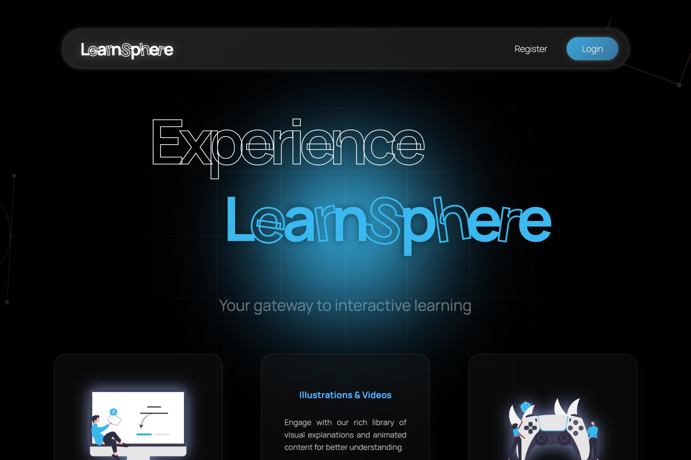
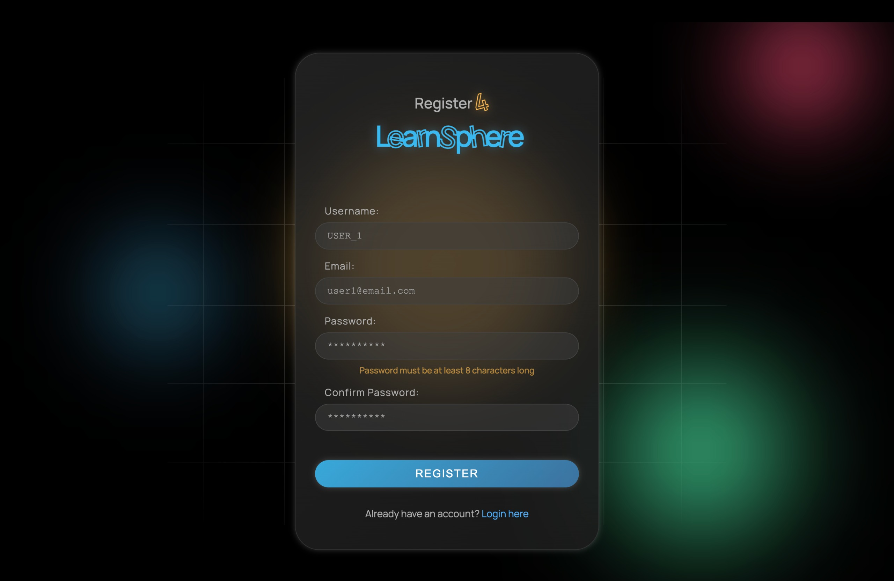
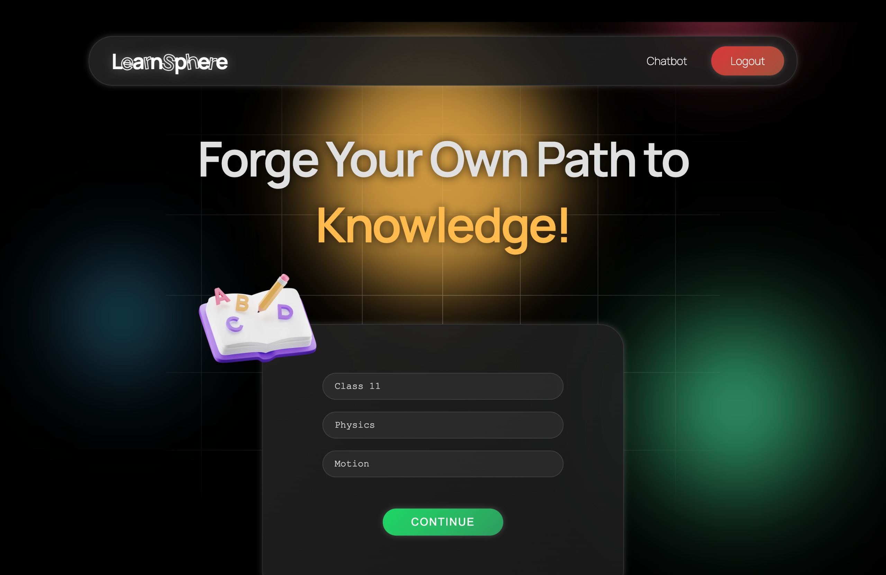
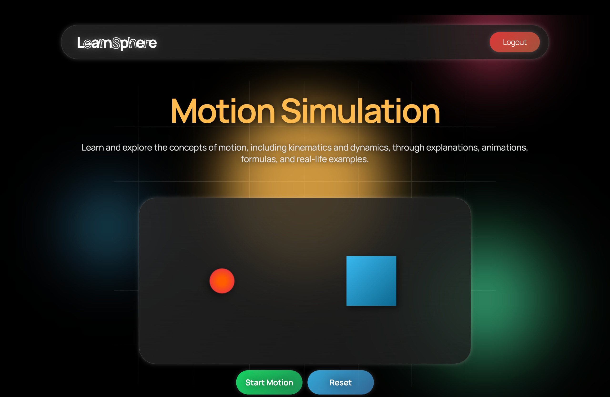

# LearnSphere

LearnSphere is a digital peer learning hub designed to enhance collaboration, knowledge sharing, and student engagement. It leverages AI-driven peer matching, gamification, and real-time communication tools to create a dynamic and inclusive learning environment.



## Inspiration
Traditional learning environments often lack structured peer interaction, making it difficult for students to find like-minded learners, share knowledge, and engage in collaborative problem-solving. LearnSphere was created to bridge this gap and provide a dedicated platform for students to connect, discuss, and learn together.

## What We Learned
Throughout the development of LearnSphere, we gained insights into:
1. The importance of personalized learning experiences through AI-driven recommendations.
2. The impact of gamification on student motivation and engagement.
3. How real-time collaboration tools improve accessibility and inclusivity.

## How We Built It
LearnSphere was built using modern web technologies and AI-driven algorithms:
1. **Frontend**: HTML/CSS/JS
2. **Backend**: Python
3. **AI Algorithms**: Collaborative filtering, clustering for smart peer-matching
4. **Communication Tools**: WebRTC for real-time video and chat
5. **Gamification**: Points, badges, and leaderboards
6. **Database**: MySQL

## Challenges Faced
Some of the key challenges we encountered included:
- Ensuring efficient peer-matching through AI while maintaining scalability.
- Implementing real-time collaboration with minimal latency.
- Designing an intuitive and user-friendly interface for seamless learning.
- Balancing privacy and security while enabling peer-to-peer interactions.

## Images
<div style="display: flex; justify-content: space-between;">
    
    
    
</div>

## Features at a Glance

### Core Features
1. **AI-Powered Peer Matching** 🧠
2. **Real-Time Discussions & Study Groups** 💬
3. **Gamified Learning Experience** 🎮
4. **Resource Sharing & Community Engagement** 📚
5. **Progress Tracking & Rewards** 🎯

### Extended Features
1. Personalized Learning Paths
2. Smart Recommendation System
3. Cross-Platform Accessibility (Web & Mobile)

## Future Scope
We aim to expand LearnSphere by:
1. Enhancing AI-driven personalization for better peer-matching.
2. Integrating AI chatbots for instant study assistance.
3. Introducing adaptive assessments to track learning progress effectively.

## Conclusion
LearnSphere is revolutionizing peer learning by fostering collaboration, engagement, and knowledge-sharing in a structured and AI-powered environment. It is more than just a platform—it’s a community-driven movement toward a more interactive and inclusive education system.

---

# Setup & Usage

This guide provides instructions for setting up and using the **LearnSphere Chatbot** built with Flask and Google Generative AI (Gemini).

## Prerequisites

Before setting up the project, ensure you have the following installed:
- **Python 3.6+**
- **pip** (Python's package installer)

You also need an API Key for Google Generative AI. The API key should be securely stored and used for authentication with the API.

## Setup Instructions

### 1. Clone the Repository

Start by cloning the LearnSphere repository from GitHub:

```bash
git clone https://github.com/omroy07/LearnSphere_1.git
cd LearnSphere_1
```

### 2. Install Required Dependencies

Install Python modules:

```bash
pip install flask flask-cors google-generativeai
```

### 3. Run the Flask App

First, navigate to the project directory:

```bash
cd Chatbot/
```

Now, run the Flask app:

- **Windows**:

    ```bash
    python app.py
    ```

- **macOS/Linux**:

    ```bash
    python3 app.py
    ```
